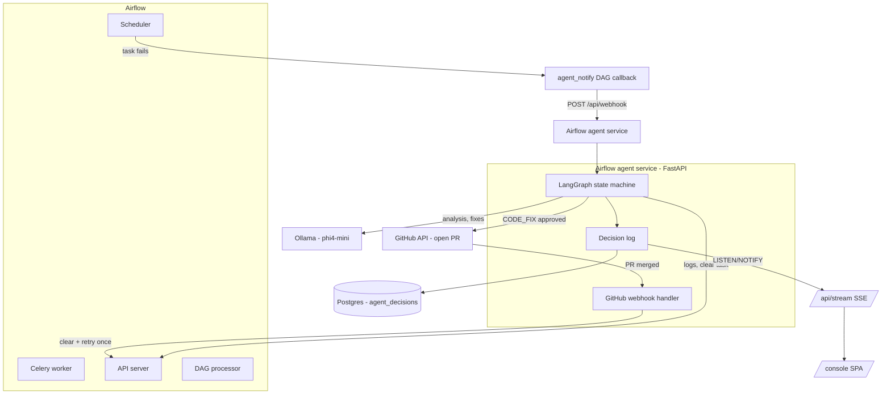
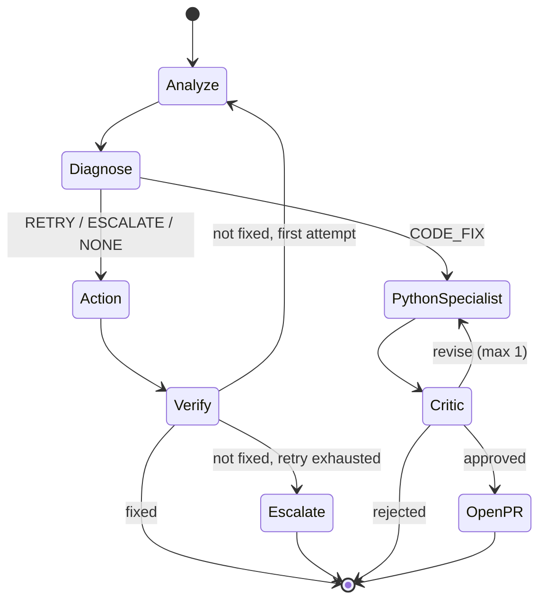

# Architecture

## System overview

Airflow, the agent service, Ollama, Postgres, and Redis all run as separate containers under one `docker-compose.yaml`. The agent talks to Airflow two ways: through an MCP server (`airflow-mcp-server`) for tool-based access, with a direct REST fallback if the MCP tool isn't found or fails — so the agent keeps working even before the exact tool names are confirmed against a live instance.

## The LangGraph state machine

`app/core/agent.py` defines the core loop as a graph, not a linear script, so branching (retry vs. escalate vs. code-fix) and looping (one retry, then stop) are explicit and inspectable rather than buried in `if` chains.

### Nodes

- **Analyze** — fetches logs (MCP first, REST fallback) and asks the LLM for a structured decision: `RETRY`, `ESCALATE`, `CODE_FIX`, or `NONE`, with reasoning. If the LLM call itself fails, that failure is caught, logged, and treated as `ESCALATE` — it never silently crashes the request.
- **Diagnose** — runs after Analyze, before any action. `schema_healer` checks the logs against a known failure shape (currently: missing table). If it applied a mechanical fix, the decision is forced to `RETRY` regardless of what the LLM said; if it only has a suggestion, it's forced to `ESCALATE` with that suggestion attached. Anything that doesn't match passes the LLM's original decision through unchanged. This exists because a small local LLM shouldn't be trusted to both diagnose *and* decide correctly on every failure shape — deterministic detection is more reliable where it's available.
- **Action** — only acts on `RETRY`: clears the task instance (MCP, then REST fallback) so Airflow re-runs it.
- **Verify** — never assumes an action worked. It polls Airflow's actual task-instance state (`VERIFY_POLL_INTERVAL_SECONDS` × `VERIFY_POLL_MAX_ATTEMPTS`) until it reaches a terminal state, and only reports `is_fixed = True` if that state is `success`.
- **Escalate** *(after retry)* — reached only when the one allowed retry still didn't fix the task. Writes an explicit, human-visible decision (`escalate_after_retry`) rather than letting the loop just stop — this is what makes a genuinely broken task show up as **Escalated** on the dashboard instead of **Unresolved**, which otherwise reads identically to "still checking."
- **Python specialist** — reached only for `CODE_FIX`. Given the failing DAG file and the traceback, proposes a full corrected file (not a diff). Runs standalone; it doesn't decide `RETRY`/`ESCALATE` and doesn't open PRs itself.
- **Critic** — reviews the specialist's proposed fix with a separate, skeptical LLM call, rather than letting the generator grade its own work. Returns `approved`, `revise` (sent back to the specialist, capped at one revision to avoid ping-ponging), or `rejected` (escalates, no PR opened).
- **Open PR** — only reached after `approved`. Opens the PR and records it so the merge webhook can find it later. If GitHub isn't configured (`GITHUB_TOKEN`/`GITHUB_REPO` unset), this fails closed to `ESCALATE` rather than pretending to succeed.

### Why one retry, not several

An earlier version allowed up to three retry loops before giving up. In practice, if a clear-and-rerun doesn't fix a task the first time, the failure usually isn't transient — retrying again is repeating the same guess, and burns up to ~90 seconds of polling per incident for no better odds. The design now caps retries at one (`MAX_RETRY_ATTEMPTS`, default `1`) and escalates explicitly and immediately after that retry fails, so a human sees a clearly labeled incident instead of a stalled loop.

### The code-fix → PR → merge → retry loop

`CODE_FIX` is handled separately from `RETRY` on purpose: clearing and re-running a task with a code bug just reproduces the same failure. Instead:

1. `python_specialist` proposes a fix, `critic` reviews it.
2. An approved fix becomes a real GitHub PR — the agent never merges its own code.
3. When a human merges the PR, `app/api/github_webhook.py` (triggered by a real GitHub webhook, verified with `GITHUB_WEBHOOK_SECRET`, or a manual `/api/prs/{pr_number}/mark-merged` endpoint for local dev) clears the task for **exactly one** post-merge retry. It doesn't re-enter the LangGraph loop — the fix already happened as merged code, not as another agent decision.

## Decision log & dashboards

Every node writes a row to `agent_decisions` (Postgres — the same instance as Airflow's own metadata DB, to avoid standing up a second database for this project's scope). Each row carries the node name, attempt number, a log excerpt, reasoning, and the action taken, so an incident's full trace is reconstructable after the fact.

Two views read this table:
- **`/console`** — a static single-page app (no build step) that reads `/api/incidents` and `/api/stats`, and subscribes to `/api/stream`, a Server-Sent Events feed driven by Postgres `LISTEN/NOTIFY` on the same table — new decisions appear the instant they're written, not on a polling interval.
- **`/dashboard`** — a simpler, server-rendered fallback view over the same data, kept intentionally separate and lightweight.

Incident status (`Fixed` / `Escalated` / `Unresolved` / `No action needed` / `Crashed` / `Pending PR review`) is derived from the row history in `incident_view.py`, not stored directly — it's read off the shape of what actually happened (was there a successful verify? does the last action contain `ESCALATE`? is there an open, unmerged PR?), so the status logic lives in exactly one place.

## Known limitations

- **No agent reads its own history.** Every decision is logged, and that log fully drives the dashboard/heatmap/stats — but `analyze` and the rest reason about each incident in isolation, with no query against past incidents for the same DAG/task. A task that's failed with the identical error 10 times and been retried 10 times with no effect gets the same fresh analysis on attempt 11. Adding a "has this happened before, and did the last fix work" check into `analyze`'s context would be a natural next step.
- **Airflow 3's task-log API returns structured JSON, not plain text** (a `{"content": [...]}` array of event objects, with the actual exception under a separate `error_detail` field, not the generic `event` string). `airflow_api.py` flattens this before it reaches the LLM or the regex-based diagnose overrides — worth knowing if you're on a different Airflow version, since the log shape may differ and the flattening logic is tailored to this one.
- **MCP tool discovery is keyword-based**, not hard-coded to exact tool names (`find_tool(tools, "task", "log")`), since the exact names `airflow-mcp-server` exposes weren't confirmed against a live instance at write time. There's a REST fallback either way, so this only affects which path is taken, not correctness.
- **Single failure-shape auto-fix** in `schema_healer` (missing table). Other deterministic patterns would need their own detectors.
- **Local LLM (`phi4-mini`)** trades off some reasoning quality for running fully locally with no external API dependency or cost — reasonable for a bounded, narrow classification task, less so for open-ended judgment calls (the critic's verdicts needed real prompt tuning to stop reflexively rejecting safe, narrow fixes). All four agents also share this same model, so the critic's "second opinion" has the same blind spots as the specialist that generated the fix — a real limitation of single-model multi-agent setups, not fully solved by prompt separation alone.
- **Decision log shares Airflow's Postgres instance.** Fine at this scale; a production system would likely isolate it so agent write volume never touches Airflow's own metadata tables.
- **Not hardened for production**: default credentials in `docker-compose.yaml`, no auth on the dashboard/console, designed for local Docker Compose use.
