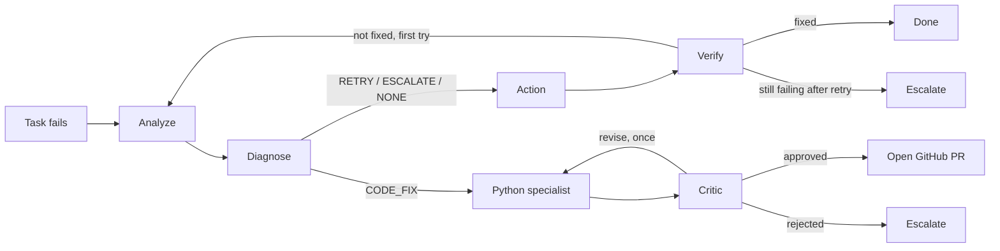

# Self-Healing Airflow

An Apache Airflow stack that diagnoses and remediates its own task failures. When a task fails, a LangGraph agent reads the logs, decides what's wrong, and takes a bounded action — retry, propose a code fix as a GitHub PR, or escalate to a human — instead of leaving the failure for someone to notice and triage by hand.

## Why

Most pipeline failures fall into a few repeating shapes: a flaky network call, a table that hasn't been created yet, a typo'd column name, an off-by-one in a transform. A human on-call ends up doing the same diagnosis over and over. This project automates that first triage step, while keeping every remediation action bounded, logged, and reversible — the agent never merges its own code, and every decision is recorded with its reasoning.

## How it works



1. **Analyze** — a local LLM (Ollama, `phi4-mini`) reads the failed task's logs and classifies the failure as `RETRY`, `ESCALATE`, `CODE_FIX`, or `NONE`.
2. **Diagnose** — a deterministic layer runs right after, and can override the LLM's classification: `schema_healer` recognizes missing-table errors and either fixes them or suggests a fix; separate regex checks force `CODE_FIX` for SQL syntax/column errors and common Python exception types (`AttributeError`, `KeyError`, `IndexError`, etc.) that the small model tends to misclassify as "no action needed." This exists because a small local LLM shouldn't be trusted to both diagnose *and* decide correctly on every failure shape it's already seen the answer to.
3. **Action / Verify** — for `RETRY`, the task is cleared and Airflow re-runs it; `verify` then polls Airflow's real task state rather than assuming success. The agent gets exactly **one retry** — if the task fails again, it escalates explicitly instead of looping further.
4. **Code-fix path** — for `CODE_FIX`, a code specialist (handles Python logic bugs *and* SQL embedded in DAG files as string literals — not Python-only, despite the module's history) proposes a corrected version of the DAG file. A separate critic agent reviews it — skeptically, but calibrated to approve narrow fixes that clearly address the exact error, not to reject anything that isn't maximally defensive — and only an approved fix results in a GitHub PR. A human always merges it; when they do, a webhook clears the task for one final retry.
5. Every step is written to a decision log with its reasoning, so an incident's full story — what the agent saw, what it decided, why — is visible after the fact. That log currently feeds the dashboard only; no agent reads its own history back in yet (see Known limitations).

## Interfaces

- **`/console`** — live single-page dashboard: incident list, status filters, an animated pipeline view, and an SSE stream so new decisions appear in real time without polling.
- **`/dashboard`** — a simpler server-rendered fallback view over the same decision log.
- **`/api/incidents`, `/api/stats`, `/api/stream`** — JSON API and SSE feed backing the console.
- **Airflow UI** (`:8080`) — the underlying pipelines, visible and manageable as normal.

## Tech stack

| Layer | Choice |
|---|---|
| Orchestration | Apache Airflow 3.2 (CeleryExecutor, Postgres, Redis) |
| Agent state machine | LangGraph |
| LLM | Ollama, `phi4-mini` (local, no external API calls) |
| Airflow tool access | MCP (`airflow-mcp-server`), with a direct REST fallback |
| Agent service | FastAPI |
| Decision log | Postgres (same instance as Airflow's metadata DB), with LISTEN/NOTIFY for live updates |
| Code-fix delivery | GitHub PRs via the GitHub API |
| Dashboard | Plain HTML/CSS/JS, no build step |

## Quickstart

```bash
git clone https://github.com/shivam041120/self-healing-airflow.git
cd self-healing-airflow
cp .env.example .env   # fill in FERNET_KEY, GITHUB_TOKEN/GITHUB_REPO if you want the code-fix path
docker compose up -d --build
```

Once the stack is healthy:
- Airflow UI: `http://localhost:8080` (default `airflow` / `airflow`)
- Agent console: `http://localhost:8000/console`
- Agent health check: `http://localhost:8000/health`

Pull the model once Ollama is up:
```bash
docker exec -it ollama ollama pull phi4-mini
```

### Trying it out

`dags/` includes several isolated failure-scenario DAGs, each a single task built to trip one specific failure shape:

| DAG | Failure shape | Expected path |
|---|---|---|
| `dag_missing_table_error` | Query against a table that doesn't exist | Auto-fixed by `schema_healer` |
| `dag_transient_connection_error` | Flaky connection | `RETRY` |
| `dag_permission_denied_error` | Insufficient DB permissions | `ESCALATE` |
| `dag_syntax_error_sql` | Misspelled SQL keyword | `CODE_FIX` |
| `dag_sql_trailing_comma_error` | Dangling comma → SQL syntax error | `CODE_FIX` |
| `dag_sql_wrong_column_error` | Query references a column that doesn't exist | `CODE_FIX` |
| `dag_python_logic_bug` | Typo'd dict key (`KeyError`) | `CODE_FIX` |
| `dag_python_attribute_error` | Method call on the wrong type (`AttributeError`) | `CODE_FIX` |
| `dag_python_index_error` | Off-by-one list access (`IndexError`) | `CODE_FIX` |

Unpause one, trigger it, let it fail, and watch `/console` — the agent should pick it up, log its analysis, and act within a few seconds.

## Project structure

```
self-healing-airflow/
├── dags/                     # Airflow DAGs, including failure-scenario demos
├── config/                   # Airflow config, schema-healer query config
├── airflow-agent/
│   └── app/
│       ├── core/              # LangGraph state machine, critic, specialists (code_specialist), MCP client
│       ├── services/          # Airflow REST client, decision log, GitHub PR service, schema healer
│       ├── api/                # FastAPI routes: dashboard, incidents/SSE, GitHub webhook
│       └── static/dashboard/  # /console single-page app
└── docker-compose.yaml
```

See [`ARCHITECTURE.md`](./ARCHITECTURE.md) for the full design writeup.

## Configuration

Key environment variables (see `.env`):

| Variable | Purpose |
|---|---|
| `OLLAMA_MODEL` | LLM used for analysis/fix proposals (default `phi4-mini`) |
| `MAX_RETRY_ATTEMPTS` | Retries allowed before escalating (default `1`) |
| `VERIFY_POLL_INTERVAL_SECONDS` / `VERIFY_POLL_MAX_ATTEMPTS` | How long `verify` polls for a terminal task state |
| `GITHUB_TOKEN`, `GITHUB_REPO`, `GITHUB_BASE_BRANCH` | Enables the code-fix → PR path. Left unset, `CODE_FIX` fails closed to `ESCALATE` |
| `GITHUB_WEBHOOK_SECRET` | Verifies the PR-merge webhook |

## Status

This is a personal/portfolio project, built and run locally via Docker Compose on Windows. It's not hardened for production use — see [`ARCHITECTURE.md`](./ARCHITECTURE.md) for known limitations.

## License

Add a license (e.g. MIT) before making the repo public, if you haven't already.
